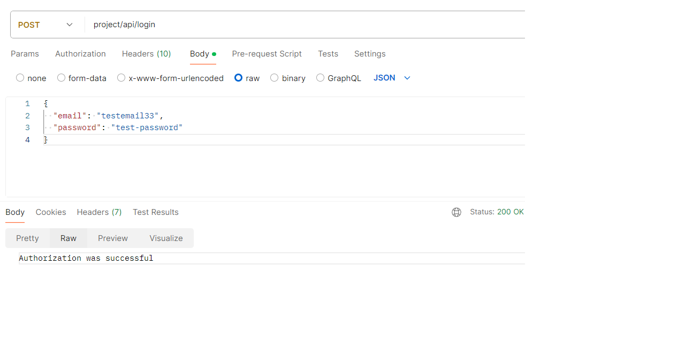
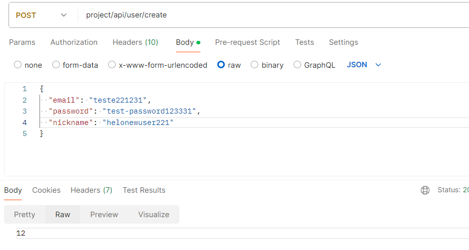
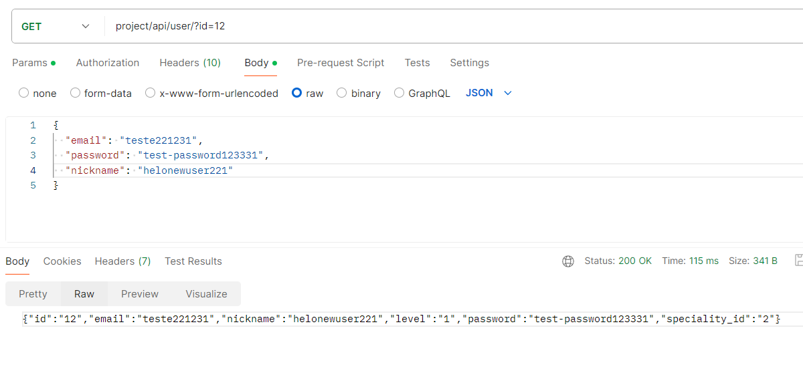
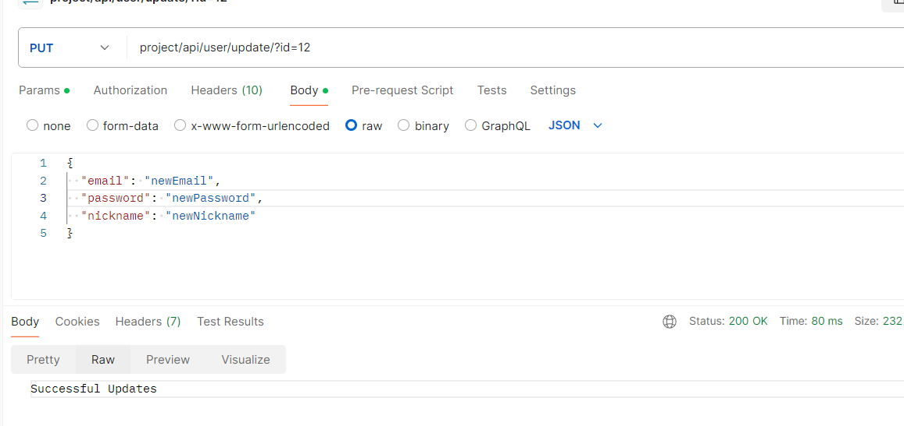
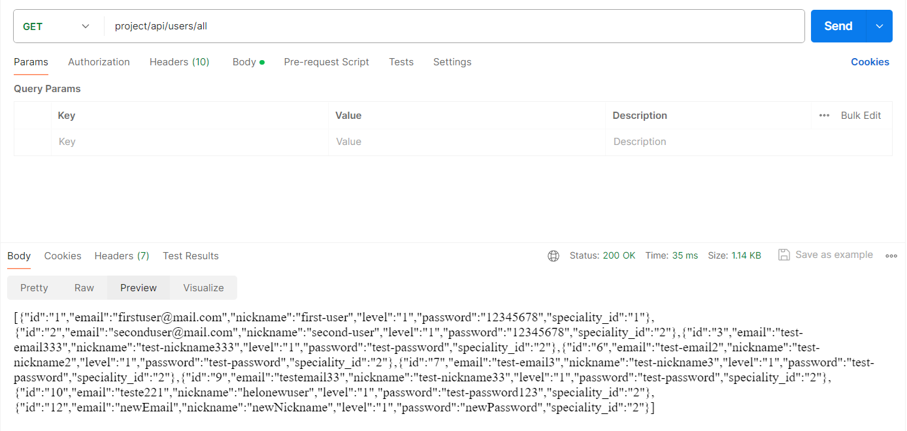

# Тестування працездатності системи

## Запит на авторизацію POST project/api/login

## Запит на реєєстрацію  POST project/api/user/create повертає id створеного юзера

## Запит на пошук юзера по id  GET project/api/user/?id=num 

## Запит на оновлення данних юзер по id  PUT project/api/user/update/?id=num 

## Запит на показ всих юзерів GET project/api/users/all
